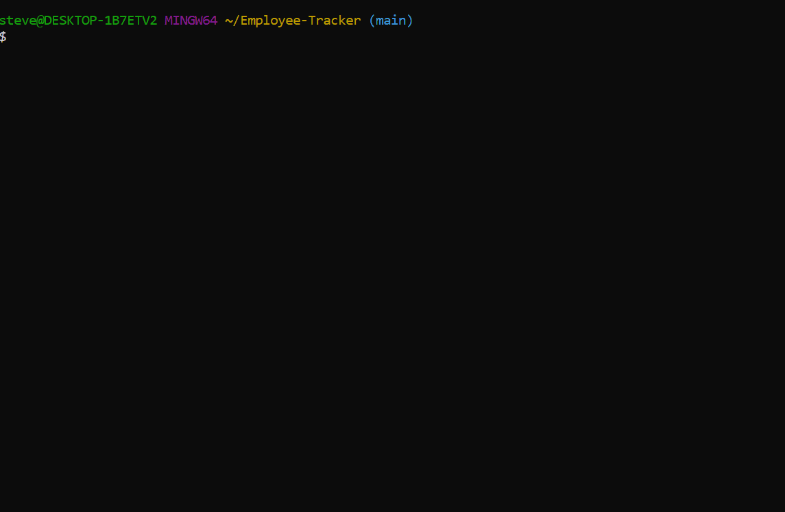

# Employee-Tracker :computer: 

[](https://opensource.org/licenses/MIT)

## Description

This is a CLI application utilizing the Inquirer package from Node.js and a MySQL database to store, update or delete information in a business setting


## Table of Contents
* [Installation](#installation)
* [Usage](#usage)
* [Demo](#demo)
* [Contributors](#contributors)
* [License](#license)

## Installation :heavy_check_mark:

Follow these steps to create a local copy of this repository so you can edit too!
1. Navigate to https://github.com/stevecarofano/Employee-Tracker
    
2. Find the green **Code** button on the right-hand side, click it and copy the repository URL with HTTPS or SSH keys
    
3. Open the command line or terminal on your machine and navigate to the destination you want the files to live in
    
4. Type git clone _pasteURLhere_
    
5. Hit Enter
    
6. Congratulations! You now have a local copy of this repository and you can make your own changes to it!

## Usage :hammer_and_wrench:

* Be sure to  have Node.js installed and run ``` npm i ``` in the root of the repository to install needed dependencies

Usage of this application is quite simple, let's go ahead and try:

* Navigate to the root of the project in your command line and run ```npm start```

* A command line interface will generate and walk you through each of the processes

## Demo



* [extended demo video](https://drive.google.com/file/d/1q2H1CTGDZmXxZOlgiE7Z_3N5p6hyTPRu/view)

## Contributors

Steve Carofano

---
## License 

MIT License

Copyright (c) [2021] [stevecarofano]

Permission is hereby granted, free of charge, to any person obtaining a copy
of this software and associated documentation files (the "Software"), to deal
in the Software without restriction, including without limitation the rights
to use, copy, modify, merge, publish, distribute, sublicense, and/or sell
copies of the Software, and to permit persons to whom the Software is
furnished to do so, subject to the following conditions:

The above copyright notice and this permission notice shall be included in all
copies or substantial portions of the Software.

THE SOFTWARE IS PROVIDED "AS IS", WITHOUT WARRANTY OF ANY KIND, EXPRESS OR
IMPLIED, INCLUDING BUT NOT LIMITED TO THE WARRANTIES OF MERCHANTABILITY,
FITNESS FOR A PARTICULAR PURPOSE AND NONINFRINGEMENT. IN NO EVENT SHALL THE
AUTHORS OR COPYRIGHT HOLDERS BE LIABLE FOR ANY CLAIM, DAMAGES OR OTHER
LIABILITY, WHETHER IN AN ACTION OF CONTRACT, TORT OR OTHERWISE, ARISING FROM,
OUT OF OR IN CONNECTION WITH THE SOFTWARE OR THE USE OR OTHER DEALINGS IN THE
SOFTWARE.

